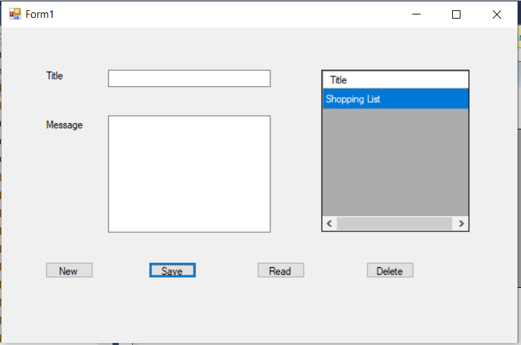
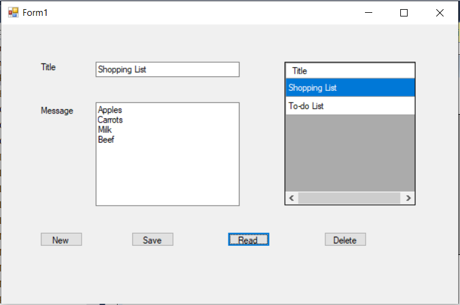
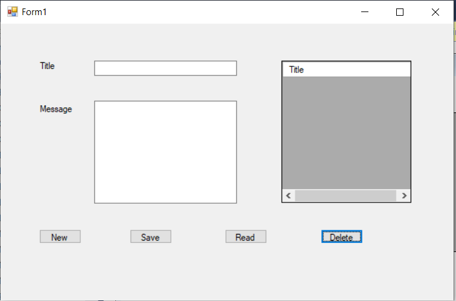

1. Adding an image by using an absolute path
* Go to "Issues" tab, and then drag and drop an image file. Then copy the created url then paste in ().
* 

2. Adding an image by using a relative path(better and safer way)  
* Add a file named "images" in the folder route, then add images in the folder.
* Use "%20" for space in the filename

2-1.  
/images/enter.PNG)

2-2. using HTML img tag  
(You can use "width" and "height" in this way. If you want to keep aspect ratio, just specify one of "width" and "height". Then the other will be "auto".)  

